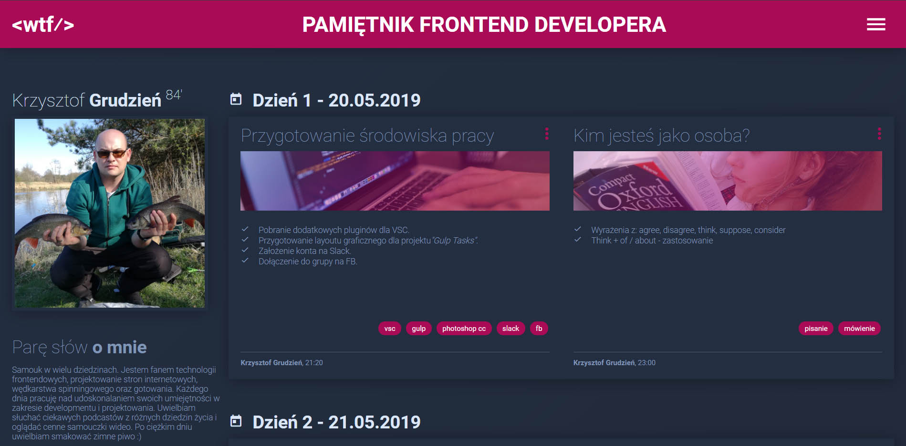

# WTF - The diary of frontend developer

If you want to know how my website looks like click here -> [Pamiętnik frontenddevelopera](https://github.com/KrzysztofGrudzien/my-diary-gulp)

## How to run my local website?

If you want run my website locally, you should follow the instruction below:

`npm install -g gulp-cli`

`npm install`

`gulp`

To publish your page using github pages use `npm run deploy`

## To be continued ...
