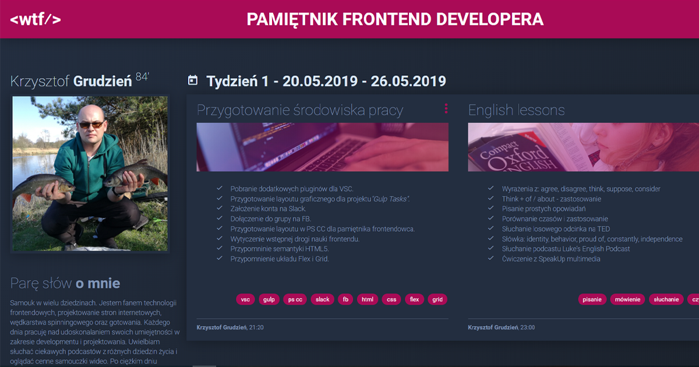

# WTF - The diary of frontend developer

If you want to know how my website looks like click here -> [Pamiętnik frontenddevelopera](https://github.com/KrzysztofGrudzien/my-diary-gulp)

## The aim of this project 🚀
The main aim of this course is learning knowledge about fundamental skills for junior frontend developer as a person who applies for a job. Thanks to that many people will have solid skills before to go to the huge frontend world where every day many programmers create something new for any.

## What I've learnt so far?
- 👍 How to write correct semantic HTML5.
- 👍 How to write correct CSS3.
- 👍 BEM methodology - fantastic approach for HTML and SASS preprocessor.
- 👍 How create prototype layout in the figma aplication.
- 👍 Right way for ES6.
- 👍 Understanding GRID and FLEX BOX.
- 👍 How use the devtools.
- 👍 How to cut graphics and code it on based preparing layout by designers.
- 👍 Basic commands for GIT
- 👍 How to use github-pages as a statis hosting.
- 👍 Basic commands for terminal.
- 👍 How prepare good workflow before coding.
- 👍 How to move between DOM elements using JS.
- 👍 How to create a different types of forms.
- 👍 How to use the Markdown language.
- 👍 Local storage, session storage - interesting approach into the projects.
- 👍 Basic applying SVG graphics and CSS animations.
- 👍 OpenGraph - new concept describing the website.
- 👍 How to create a different types of forms.
- 👍 PWA - new approaches to creating a mobile APP.
- 👍 WCAG - accesibility - basic concept.
- 👍 How to work with the REST API, JSON.
- 👍 Testing website using on-line tools (different browsers, platform, mobile devices).
- 👍 Basic optimalization - lighthouse, minification, critics CSS.
- 👍 Project from A to Z - my portfolio 😉.

## Tools and technology I've used
- ✔ HTML5, CSS3, JS ES6
- ✔ Visual Studio Code
- ✔ Figma, Photoshop CC, Inkscape
- ✔ Task runner - GULP
- ✔ Running environment - Node.js and NPM

## How to run my local website?

If you want run my website locally, you should follow the instruction below:

`npm install -g gulp-cli`

`npm install`

`gulp`

To publish your page using github pages use `npm run deploy`
